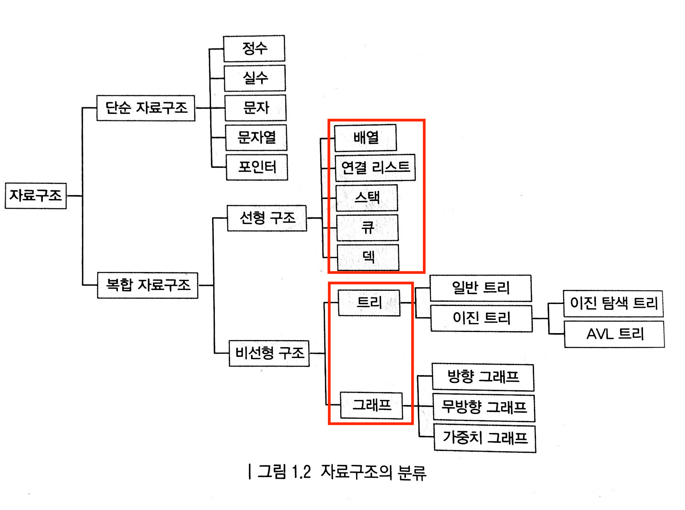

# `자료구조`(data Structure)
`자료구조`는 **데이터 보관 방법과 데이터에 관한 연산의 총체**이다.

## 단순(Primitive) 자료구조
프로그램 언어에서 통상적으로 제공하는 기본 데이터 형식

## 복합(Non-Primitive) 자료구조

- `선형 자료구조`(Linear Data Structure): 데이터 요소를 순차적으로 연결하는 자료구조

- `비선형 자료구조`(Non-Linear Data Structure): 데이터 요소를 비순차적으로 연결

---

## 추상데이터 형식 `ADT`(Abstract Data Types)
: 자료구조의 동작 방법을 표현하는 데이터 형식
> 자료구조가 갖춰야 할 일련의 연산
> > C언어에서는 함수 

> ADT는 정의하기 나름임, '어떤 ADT가 특정 연산을 반드시 제공해야 한다'는 법은 없음.

<table border="1">
  <tr>
    <th>ADT</th>
    <th>자료구조</th>
  </tr>
  <tr>
    <td rowspan='3'>리스트</td>
    <td>링크드 리스트</td>
  </tr>
  <tr>
    <td>더블 링크드 리스트</td>
  </tr>
    <td>환형 리스트</td>
</tr>
  <tr>
    <td rowspan='2'>스택</td>
    <td>배열 기반 스택</td>
  </tr>
  <tr>
    <td>링크드 리스트 기반 스택</td>
  </tr>
  <tr>
    <td rowspan='2'>큐</td>
    <td>환형 큐</td>
  </tr>
  <tr>
    <td>링크드 큐</td>
  </tr>
  <tr>
    <td rowspan='3'>트리</td>
    <td>이진 트리</td>
  </tr>
  <tr>
    <td>LCRS 트리</td>
  </tr>
    <td>레드 블랙 트리</td>
</tr>
  <tr>
    <td rowspan='2'>그래프</td>
    <td>방향성 그래프</td>
  </tr>
  <tr>
    <td>무방향성 그래프</td>
  </tr>
  <tr>
    <td rowspan='2'>힙</td>
    <td>배열 기반 힙</td>
  </tr>
  <tr>
    <td>링크드 리스트 기반 힙</td>
  </tr>
</table>

---

## 자료구조의 중요성
1. 자료구조의 내부를 이해하면 라이브러리에서 엉뚱한 자료구조를 선택하는 일을 피할 수 있다.
    > 동일한 ADT를 사용하더라도 자료구조에 따라 애플리케이션 성능이 크게 달라짐
2. 자료구조는 알고리즘이 데이터를 효율적으로 사용할 수 있게 해주는 핵심이다.
    > 자료구조를 모르면 알고리즘 공부하기 어려움